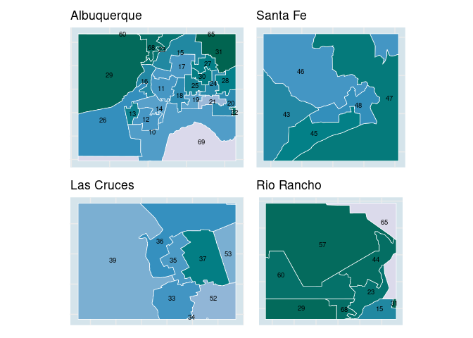
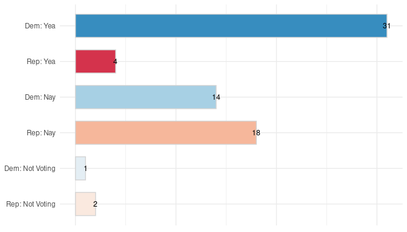
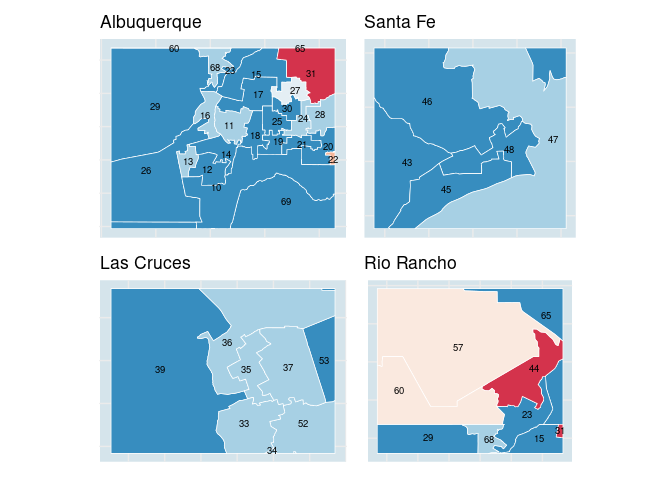

Mapping state legislative data
==============================

Census data
-----------

### Legislative geometries

``` r
library(tidyverse) 
library(tigris); options(tigris_use_cache = TRUE, tigris_class = "sf")

nm_uppers <- tigris::state_legislative_districts(state = 'New Mexico',
                                                 house = 'upper', cb = T) %>%
  mutate(district_code = as.integer(substr(SLDUST, 2, 3))) 

nm_lowers <- tigris::state_legislative_districts(state = 'New Mexico',
                                                 house = 'lower', cb = T) %>%
  mutate(district_code = as.integer(substr(SLDLST, 2, 3))) 
```

    ##   |                                                                              |                                                                      |   0%  |                                                                              |===                                                                   |   5%  |                                                                              |=====                                                                 |   7%  |                                                                              |========                                                              |  11%  |                                                                              |=========                                                             |  13%  |                                                                              |============                                                          |  18%  |                                                                              |==============                                                        |  20%  |                                                                              |=================                                                     |  24%  |                                                                              |==================                                                    |  26%  |                                                                              |=====================                                                 |  31%  |                                                                              |=======================                                               |  33%  |                                                                              |==========================                                            |  37%  |                                                                              |============================                                          |  39%  |                                                                              |===============================                                       |  44%  |                                                                              |================================                                      |  46%  |                                                                              |===================================                                   |  50%  |                                                                              |=====================================                                 |  52%  |                                                                              |========================================                              |  57%  |                                                                              |=========================================                             |  59%  |                                                                              |============================================                          |  63%  |                                                                              |==============================================                        |  65%  |                                                                              |=================================================                     |  70%  |                                                                              |==================================================                    |  72%  |                                                                              |=====================================================                 |  76%  |                                                                              |=======================================================               |  78%  |                                                                              |==========================================================            |  83%  |                                                                              |===========================================================           |  85%  |                                                                              |==============================================================        |  89%  |                                                                              |================================================================      |  91%  |                                                                              |===================================================================   |  96%  |                                                                              |====================================================================  |  98%  |                                                                              |======================================================================| 100%

``` r
nm_counties <- tigris::counties(state = 'New Mexico', cb = T)
```

    ##   |                                                                              |                                                                      |   0%  |                                                                              |                                                                      |   1%  |                                                                              |=                                                                     |   1%  |                                                                              |=                                                                     |   2%  |                                                                              |==                                                                    |   2%  |                                                                              |==                                                                    |   3%  |                                                                              |==                                                                    |   4%  |                                                                              |===                                                                   |   4%  |                                                                              |===                                                                   |   5%  |                                                                              |====                                                                  |   5%  |                                                                              |====                                                                  |   6%  |                                                                              |=====                                                                 |   7%  |                                                                              |=====                                                                 |   8%  |                                                                              |======                                                                |   8%  |                                                                              |======                                                                |   9%  |                                                                              |=======                                                               |   9%  |                                                                              |=======                                                               |  10%  |                                                                              |=======                                                               |  11%  |                                                                              |========                                                              |  11%  |                                                                              |========                                                              |  12%  |                                                                              |=========                                                             |  12%  |                                                                              |=========                                                             |  13%  |                                                                              |=========                                                             |  14%  |                                                                              |==========                                                            |  14%  |                                                                              |==========                                                            |  15%  |                                                                              |===========                                                           |  15%  |                                                                              |===========                                                           |  16%  |                                                                              |============                                                          |  16%  |                                                                              |============                                                          |  17%  |                                                                              |============                                                          |  18%  |                                                                              |=============                                                         |  18%  |                                                                              |=============                                                         |  19%  |                                                                              |==============                                                        |  19%  |                                                                              |==============                                                        |  20%  |                                                                              |==============                                                        |  21%  |                                                                              |===============                                                       |  21%  |                                                                              |===============                                                       |  22%  |                                                                              |================                                                      |  22%  |                                                                              |================                                                      |  23%  |                                                                              |=================                                                     |  24%  |                                                                              |=================                                                     |  25%  |                                                                              |==================                                                    |  25%  |                                                                              |==================                                                    |  26%  |                                                                              |===================                                                   |  26%  |                                                                              |===================                                                   |  27%  |                                                                              |===================                                                   |  28%  |                                                                              |====================                                                  |  28%  |                                                                              |====================                                                  |  29%  |                                                                              |=====================                                                 |  29%  |                                                                              |=====================                                                 |  30%  |                                                                              |=====================                                                 |  31%  |                                                                              |======================                                                |  31%  |                                                                              |======================                                                |  32%  |                                                                              |=======================                                               |  32%  |                                                                              |=======================                                               |  33%  |                                                                              |=======================                                               |  34%  |                                                                              |========================                                              |  34%  |                                                                              |========================                                              |  35%  |                                                                              |=========================                                             |  35%  |                                                                              |=========================                                             |  36%  |                                                                              |==========================                                            |  37%  |                                                                              |==========================                                            |  38%  |                                                                              |===========================                                           |  38%  |                                                                              |===========================                                           |  39%  |                                                                              |============================                                          |  39%  |                                                                              |============================                                          |  40%  |                                                                              |============================                                          |  41%  |                                                                              |=============================                                         |  41%  |                                                                              |=============================                                         |  42%  |                                                                              |==============================                                        |  42%  |                                                                              |==============================                                        |  43%  |                                                                              |==============================                                        |  44%  |                                                                              |===============================                                       |  44%  |                                                                              |===============================                                       |  45%  |                                                                              |================================                                      |  45%  |                                                                              |================================                                      |  46%  |                                                                              |=================================                                     |  47%  |                                                                              |=================================                                     |  48%  |                                                                              |==================================                                    |  48%  |                                                                              |==================================                                    |  49%  |                                                                              |===================================                                   |  49%  |                                                                              |===================================                                   |  50%  |                                                                              |===================================                                   |  51%  |                                                                              |====================================                                  |  51%  |                                                                              |====================================                                  |  52%  |                                                                              |=====================================                                 |  52%  |                                                                              |=====================================                                 |  53%  |                                                                              |======================================                                |  54%  |                                                                              |======================================                                |  55%  |                                                                              |=======================================                               |  55%  |                                                                              |=======================================                               |  56%  |                                                                              |========================================                              |  56%  |                                                                              |========================================                              |  57%  |                                                                              |========================================                              |  58%  |                                                                              |=========================================                             |  58%  |                                                                              |=========================================                             |  59%  |                                                                              |==========================================                            |  59%  |                                                                              |==========================================                            |  60%  |                                                                              |==========================================                            |  61%  |                                                                              |===========================================                           |  61%  |                                                                              |===========================================                           |  62%  |                                                                              |============================================                          |  62%  |                                                                              |============================================                          |  63%  |                                                                              |=============================================                         |  64%  |                                                                              |=============================================                         |  65%  |                                                                              |==============================================                        |  65%  |                                                                              |==============================================                        |  66%  |                                                                              |===============================================                       |  66%  |                                                                              |===============================================                       |  67%  |                                                                              |===============================================                       |  68%  |                                                                              |================================================                      |  68%  |                                                                              |================================================                      |  69%  |                                                                              |=================================================                     |  69%  |                                                                              |=================================================                     |  70%  |                                                                              |=================================================                     |  71%  |                                                                              |==================================================                    |  71%  |                                                                              |==================================================                    |  72%  |                                                                              |===================================================                   |  72%  |                                                                              |===================================================                   |  73%  |                                                                              |====================================================                  |  74%  |                                                                              |====================================================                  |  75%  |                                                                              |=====================================================                 |  75%  |                                                                              |=====================================================                 |  76%  |                                                                              |======================================================                |  76%  |                                                                              |======================================================                |  77%  |                                                                              |======================================================                |  78%  |                                                                              |=======================================================               |  78%  |                                                                              |=======================================================               |  79%  |                                                                              |========================================================              |  79%  |                                                                              |========================================================              |  80%  |                                                                              |========================================================              |  81%  |                                                                              |=========================================================             |  81%  |                                                                              |=========================================================             |  82%  |                                                                              |==========================================================            |  82%  |                                                                              |==========================================================            |  83%  |                                                                              |==========================================================            |  84%  |                                                                              |===========================================================           |  84%  |                                                                              |===========================================================           |  85%  |                                                                              |============================================================          |  85%  |                                                                              |============================================================          |  86%  |                                                                              |=============================================================         |  86%  |                                                                              |=============================================================         |  87%  |                                                                              |=============================================================         |  88%  |                                                                              |==============================================================        |  88%  |                                                                              |==============================================================        |  89%  |                                                                              |===============================================================       |  89%  |                                                                              |===============================================================       |  90%  |                                                                              |===============================================================       |  91%  |                                                                              |================================================================      |  91%  |                                                                              |================================================================      |  92%  |                                                                              |=================================================================     |  92%  |                                                                              |=================================================================     |  93%  |                                                                              |=================================================================     |  94%  |                                                                              |==================================================================    |  94%  |                                                                              |==================================================================    |  95%  |                                                                              |===================================================================   |  95%  |                                                                              |===================================================================   |  96%  |                                                                              |====================================================================  |  96%  |                                                                              |====================================================================  |  97%  |                                                                              |====================================================================  |  98%  |                                                                              |===================================================================== |  98%  |                                                                              |===================================================================== |  99%  |                                                                              |======================================================================|  99%  |                                                                              |======================================================================| 100%

### Some relevant census variables

``` r
## recall -- variable names change per estimate-type --
v_list <-  c(
  hs_higher = 'DP02_0067P',
  bachelors_higher = 'DP02_0068P',
  foreign_born = 'DP02_0093P',
  non_english_home = 'DP02_0113P',
  computer_home = 'DP02_0152P',
  internet_home = 'DP02_0153P',
  
  unemployed = 'DP03_0005P',
  median_income = 'DP03_0062',## no match per year --
  
  over_65 = 'DP05_0024P',
  hispanic = 'DP05_0071P',
  white = 'DP05_0077P', #
  black = 'DP05_0078P'
  ) 
```

### Cross 1-year to 5-year

``` r
##
x <- tidycensus::load_variables(year = '2019', dataset = "acs1/profile")
y <- tidycensus::load_variables(year = '2018', dataset = "acs5/profile") %>%
  filter(!grepl('PR', name))

## Issue == 'Percent Estimate' -- 
x1 <- x %>% filter(name %in% unname(v_list))
y1 <- y %>% 
  mutate(label = gsub('Percent Estimate', 
                      'Percent', 
                      label),
         label = gsub('2018', '2019', label)) %>% 
  filter(label %in% x1$label)


## new v_list, then: 
v_list_5y <- y1$name

names(v_list_5y) <- names(v_list)
```

### Get ACS data

``` r
nms <-  tidycensus::get_acs(geography = 'State Legislative District (Lower Chamber)',
                            state = 'New Mexico',
                            variables = v_list_5y,
                            year = 2018,
                            survey = 'acs5', 
                            geometry = F) %>%
  mutate(district_code = as.integer(substr(GEOID, 4, 5))) 
```

### Visualizing Cenus data

``` r
theme_guide <- function () {
  
    theme(axis.title.x=element_blank(), 
          axis.text.x=element_blank(),
          axis.title.y=element_blank(),
          axis.text.y=element_blank(),
          legend.title=element_blank(),
          legend.position = 'none', 
          complete = F) }
```

#### Main plot

``` r
geo <- nm_lowers %>%
  left_join(nms, by = 'district_code') %>%
  filter(variable == 'internet_home') 

mins <- min(geo$estimate)
maxs <- max(geo$estimate)

main <- geo %>%
  ggplot() + 
  geom_sf(aes(fill = estimate),
           color = 'white',
          lwd = 0.3) + 
  
  scale_fill_distiller(palette = "PuBuGn", direction = 1,
                       limit = range(c(mins, maxs))) + #PuBu

  geom_sf_text(aes(label = district_code),
            color = 'black',
            size=2, 
            check_overlap = TRUE) +
   
  theme_minimal() + theme_guide() +
  theme(legend.position = 'bottom') +
  theme(panel.background = 
        element_rect(fill = '#d5e4eb', color = NA)) +
  ggtitle('New Mexico')
```

#### Zoomed plots

``` r
sub_geos <- c('Albuquerque, NM',
              'Santa Fe, NM',
              'Las Cruces, NM',
              'Rio Rancho, NM')

minis <- lapply(sub_geos, function(x) {
    
    lc <- tmaptools::geocode_OSM (q = x, as.sf = T)
    lc$bbox <- sf::st_set_crs(lc$bbox, sf::st_crs(geo))
    cropped <- sf::st_crop(geo, lc$bbox) ## come fn time, a distinct 
    
    ggplot() + 
      geom_sf(data = cropped, 
                     aes(fill = estimate),
                     color = 'white', size = .25) +
      
      geom_sf_text(data = cropped, 
                   aes(label = district_code),
            color = 'black',
            size=2.5, 
            check_overlap = TRUE) +
      
  scale_fill_distiller(palette = "PuBuGn", direction = 1,
                       limit = range(c(mins, maxs))) + #PuBu
      
      theme_minimal() + theme_guide() +
      theme(panel.background = 
        element_rect(fill = '#d5e4eb', color = NA)) +
      ggtitle(gsub(',.*$', '', x))   })
```

``` r
ms <-  patchwork::wrap_plots(minis, nrow = 2)
```

#### Patchwork

``` r
library(patchwork)

main + patchwork::wrap_plots(ms) + 
  #patchwork::plot_layout(ncol = 2, widths = c(3, 2)) +
  plot_annotation(
    title = 'Percent of Households with a broadband internet subscription', 
    subtitle = 'SELECTED SOCIAL CHARACTERISTICS IN THE UNITED STATES',
     caption = 'Source: Table DP02-0153P, ACS 5-year Estimates, 2014-18 | Viz by @DrJayTimm')
```



Mapping roll calls via Open States
----------------------------------

``` r
local_dir <- '/home/jtimm/jt_work/GitHub/packages/nmpols/data-raw/'
setwd(local_dir)
nm_openstates <- readRDS('nm_open_states_2019.rds')
```

### Some parameters

``` r
chamber <- 'lower'
bill_title <- 'EXEMPT NM FROM DAYLIGHT SAVINGS TIME'
# chamber <- 'upper'
# bill_title <- 'PERMANENT DAYLIGHT SAVING TIME'

if(chamber == 'upper') { 
  map_sf <- nm_uppers
  chamber1 <- 'Senate'} else {
  map_sf <- nm_lowers
  chamber1 <- 'House'
}
```

### Summarizing roll call

``` r
nmp <- nm_openstates %>%
  filter(title == bill_title,
         current_chamber == chamber)
```

``` r
roll <- nmp %>% 
  group_by(Party_Member_Vote) %>%
  count() %>%
  ungroup() %>%
  rename(Vote = Party_Member_Vote) 

rsum <- roll %>% 
  ggplot(aes(x=Vote, y=n, fill= Vote, label = n)) +
    geom_col(width=.65, color = 'lightgray') +  
    geom_text(size = 3.25) +
    wnomadds::scale_color_rollcall(aesthetics = c("fill")) +
    scale_x_discrete(limits = rev(levels(roll$Vote)))+

    theme_minimal() + 
  coord_flip() +
      theme(axis.title.x=element_blank(),
            axis.text.x=element_blank(),
            axis.title.y=element_blank(),
            legend.position = 'none')

rsum #+ ggtitle(vra$short_description)
```



``` r
summary1 <- nmp %>%
  group_by(current_party, vote) %>%
  count() %>%
  spread(vote, n) %>%
  janitor::adorn_totals(where = c('row', 'col')) %>%
  rename(Party = current_party#, NV = `Not Voting`
         ) 
  #select(Party, Yea, Nay, NV, Total)


summary2 <- nmp %>%
  group_by(vote) %>%
  count() %>%
  mutate(x = row_number()) %>%
  spread(vote, n) %>%
  select(-x) %>%
  janitor::adorn_totals(where = c('col')) 
  #rename(#Party = current_party,
  #       NV = `Not Voting`) %>%
  #select(Yea, Nay, NV, Total)
```

### Visualizing roll calls

#### Main plot

``` r
nmp1 <- map_sf %>%
  left_join(nm_openstates, 
            by = c('district_code' = 'current_district'))  %>%
  filter(title == bill_title)

results <- paste0('Yea: ', summary2$Yea, ' | ', 'Nay: ', summary2$Nay)

main1 <-  nmp1 %>%
  ggplot() + 
  geom_sf(aes(fill = Party_Member_Vote), 
          color = 'white',
          size = .25) + 
  
  geom_sf_text(aes(label = district_code),
            color = 'black',
            size=2, 
            check_overlap = TRUE) +
  
  wnomadds::scale_fill_rollcall() +
  theme_minimal() + theme_guide() +
  theme(panel.background = 
        element_rect(fill = '#d5e4eb', color = NA)) +
  ggtitle(results)
```

#### Zoomed plots

``` r
geo <- nmp1

minis <- lapply(sub_geos, function(x) {
    
    lc <- tmaptools::geocode_OSM (q = x, as.sf = T)
    lc$bbox <- sf::st_set_crs(lc$bbox, sf::st_crs(geo))
    cropped <- sf::st_crop(geo, lc$bbox)
    
    ggplot() + 
      geom_sf(data = cropped, 
                     aes(fill = Party_Member_Vote), ## param --
                     color = 'white', size = .25) +
      
      geom_sf_text(data = cropped, 
                   aes(label = district_code),
            color = 'black',
            size=2.5, 
            check_overlap = TRUE) +
      
      wnomadds::scale_fill_rollcall() +
      theme_minimal() + theme_guide() +
            theme(panel.background = 
        element_rect(fill = '#d5e4eb', color = NA)) +
      ggtitle(gsub(',.*$', '', x))   })


ms <-  patchwork::wrap_plots(minis, nrow = 2)
```

#### Full summary

``` r
t2 <- gridExtra::tableGrob(summary2, 
                           rows = NULL, 
                           theme = gridExtra::ttheme_minimal(base_size = 8)) 

msa <- patchwork::wrap_elements(t2)
## ms0 <- msa / rsum
ms1 <-  minis[[1]] + rsum + patchwork::plot_layout(nrow = 1, widths = c(2,1))
ms2 <- minis[[2]] + minis[[3]] + minis[[4]]

## msa / main1 + patchwork::plot_layout(ncol = 1, widths = c(1,5))

main1 + (ms1/ms2) +
  plot_annotation(
    title = nmp$title, 
    subtitle = paste0('New Mexico State ', chamber1, ' Roll Call (2019)'),
    caption = 'Data source: openstates.org | Viz by @DrJayTimm')
```


